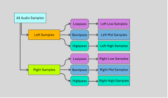

# MaZe Music Visualizer
Der MaZe Music Visualizer ist eine graphische Desktopanwendung zur Visualisierung von Musik und anderen Audiodateien.
Ziel des Projektes ist es, die Computergraphik mit Tonwiedergabe zu kombinieren. Die Anwendung soll die Musik in Echtzeit analysieren und die Ergebnisse in Form von Animationen darstellen.
Dieses Projekt ist auf [GitHub](https://github.com/MaZe3D/Hello_Space) verfügbar.
Eine Demonstration des Shaders als Video ist auf [YouTube](https://youtu.be/-ILrTO3HTTI) verfügbar.

## Bauen
Die Anwendung verwendet Betriebssystem-spezifische Bibliotheken, weshalb derzeit zur Ausführung Microsoft Windows benötigt wird.
Das Projekt basiert auf der [.NET 8.0 Plattform](https://dotnet.microsoft.com/en-us/download) und kann mit dem .NET SDK gebaut werden.
Die Anwendung kann mit dem Befehl `dotnet run` ausgeführt werden.
Bei dem Bauvorgang wird das Verzeichnis `res/` vollständig zur Binary kopiert. Die Dateien in diesem Verzeichnis werden zur Laufzeit benötigt.

## Systemanforderungen
Die Anwendung benötigt einen modernen Grafikprozessor mit Unterstützung für OpenGL 4.3, sowie eine CPU mit mindestens 4 Kernen.

Getestet wurde die Anwendung auf einem AMD Ryzen™ 7 2700X (8 Kerne, 16 Threads) und einer Nvidia GeForce™ RTX 2080 Ti mit 11GB.
Zusätzlich fand ein Laptop mit einem Intel® Core™ H35 i7-11370H und einer Nvidia GeForce™ RTX 3050 Ti Laptop GPU mit 6GB Verwendung.
Auf beiden Systemen war der Shader ohne Probleme ausführbar, jedoch ist die Berechnung der Audio Samples für jeden Frame rechenaufwendig, weshalb bei Laptops die Verwendung eines Netzteils empfohlen wird, um die volle Leistung des Systems zu gewährleisten. In voller Geschwindigkeit läuft die Anwendung mit ca. 120 FPS, darunter ist ein Leistungsgrenze erkenntlich.

Aufgrund von Betriebssystemspezifischen Funktionen ist die Anwendung derzeit nur unter Microsoft Windows ausführbar. Getestet wurde `Windows 11 Version 23H2 (Build 22631.2792)`.

## Verwendung
Das Programm benötigt eine Audiodatei im FLAC-Format. Diese muss im Verzeichnis `res/audio/` liegen und `audio.flac` heißen. Der `res/` Ordner muss sich im selben Verzeichnis wie die Binary befinden.

Nach Programmstart lädt die Anwendung die Audiodatei und bereitet die Visualisierung vor. Dieser Vorgang kann einige Sekunden dauern. Währenddessen wird ein schwarzer Bildschirm angezeigt. Sobald die Anwendung zur Wiedergabe bereit ist, ist im Titelbalken neben dem Anwendungstitel die Bildwiederholrate und die aktuelle Wiedergabezeit zu sehen. Die Wiedergabe kann mit der `Leertaste` gestartet und pausiert werden.
Am Ende der Audiowiedergabe wird die Wiedergabe von neuem gestartet. Die Anwendung kann mit der `Escape` Taste beendet werden.

### Tastenbelegung
| Taste | Funktion |
| --- | --- |
| `Escape` | Beendet die Anwendung. |
| `Leertaste` | Startet und Pausiert die Wiedergabe. |
| `M` | Schaltet den Leuchteffekt rund um den Mauszeiger aus und an. |
| `R` | Lädt alle Ressourcen (Shader und Audiodateien) neu und setzt die Wiedergabe auf den Beginn zurück. Kann genutzt werden um einen anderen, kompatiblen Shader während der Laufzeit zu laden oder die Audiodatei während der Laufzeit zu wechseln. |
| `S` | Gibt einen detaillierte Informationen zu den berechneten Frequenzen im Standard Debug Output aus. |

### Maussteuerung
Die Software verfügt über die Möglichkeit mithilfe eines Mausklicks oder -ziehens die Wiedergabeposition anzupassen. Hierfür muss auf dem Fortschrittsbalken auf dem unteren Bildschirmrand geklickt werden.

## Funktionsweise
Der Programmablauf sieht vor dass zunächst das Fenster erstellt wird. Im Konstruktor des Fensters wird ebenfalls die Audiobibliothek initialisiert. Darauf hin werden sämtliche Vorbereitungen zur Darstellung des Shaders getroffen. Der Vertex und Fragment Shader werden geladen und schließlich werden die Bilder berechnet.

### Audio
Zur Aufbereitung der Audiodaten bedarf es einiger schritte, sodass die Visualisierung ansprechend aussieht.
Be der Initialisierung der `Audio` Klasse wird zunächst die Audiodatei eingelesen. Daraufhin werden alle Samples aus dem Audiostream ausgelesen.

Da es sich um Stereoinhalte handelt befinden in dem Array aller Samples sowohl die Samples für den linken als auch den rechten Kanal. Dabei sind die Samples Interleaved (Verschränkt). Daher sind alle Samples des linken Kanal an der Position `2n` und alle Samples des rechten Kanals an der Position `2n + 1`. Die Samples werden auf zwei Arrays jeweils für den linken und rechten Audiokanal aufgeteilt und in einer Instanz der Struktur `Stereo Audio` gespeichert.

```cs
public struct StereoAudio
{
    public float[] Left;
    public float[] Right;
}
```

Um nun für den Shader die daten aufzubereiten werden beide Kanäle gefiltert. Einmal durch einen Tiefpass, Bandpass und einen Hochpass. Dies erfolgt mithilfe der `BiQuadFilter` welche Teil der `naudio.Dsp` Namespaces ist.
Der Tiefpass hat eine Grenzfrequenz von 200 Hz, der Bandpass arbeitet um ca. 600 Hz und der Hochpass hat eine Grenzfrequenz von 1000 Hz.

Nach der Filterung befinden sich die Samples in den respektiven `StereoAudio` Instanzen in der `Audio`-Klasse.
```cs
public StereoAudio bassData;
public StereoAudio midData;
public StereoAudio highData;
```



Nun kann bei jedem Bild die aktuelle Wiedergabezeit herangezogen werden um die Samples zu berechnen welche in diesem Zeitraum abgespielt werden. Bei jedem Frame werden `0,1s` an Samples ausgewertet und arithmetisch gemittelt. Dies geschieht in der Funktion `public StereoSample GetSampleAtTimeSpan(float offset, float time, AudioFrequencyBand band)`. Die Funktion gibt eine Instanz der Struktur `StereoSample` zurück.

```cs
public struct StereoSample
{
    public float Left;
    public float Right;
}
```

Die Mittelung wird für jeden Frequenzbereich und jeden Kanal einzeln durchgeführt. Das bedeutet bei einer Sampling Rate von `44,1 kHz` und `0,1 s` auszuwertenden Materials und sechs Sechs Sample-Arrays dass insgesamt `26460` Samples ausgewertet werden. Das sind viele Berechnungen, welche möglicherweise für zukünftige Updates optimiert werden können.


### Shader
Die Anwendung basiert auf OpenGL 4.3 und verwendet die [OpenTK](https://opentk.net/) Bibliothek für die Interaktion mit OpenGL. Die Shader werden mit [GLSL](https://www.khronos.org/opengl/wiki/Core_Language_(GLSL)) geschrieben.

Die OpenGL Shader Pipeline sieht mehrere unterschiedliche Shader vor um das Bild (abschließend) zu berechnen. In dieser Applikation findet der Vertex- und Fragment-Shader Anwendung.

#### Vertex Shader
Der Vertex Shader ist ein programmierbarer Shader, der die Verarbeitung von einzelnen Vertices im Rendering-Pipeline übernimmt. Vertex-Shader erhalten Vertex-Attribute-Daten, die von einem Zeichenbefehl aus einem Vertex-Array-Objekt spezifiziert werden. Ein Vertex-Shader erhält einen einzelnen Vertex aus dem Vertex-Stream und generiert einen einzelnen Vertex für den Ausgangs-Vertex-Stream 1. Es muss eine 1:1-Zuordnung von Eingangs- zu Ausgangs-Vertices geben. Vertex-Shader führen in der Regel Transformationen in den Post-Projektionsraum durch, um von der Vertex-Post-Processing-Phase verarbeitet zu werden. Sie können auch verwendet werden, um pro-Vertex-Beleuchtung durchzuführen oder Setup-Arbeiten für spätere Shader-Stufen durchzuführen.

Der für dieses Programm notwendige Shader genießt, da die eigentliche Bildberechnung erst im später folgenden Fragment-Shader erfolgt, eine untergeordnete Rolle. Das Hauptprogramm generiert eine kompakte liste an Koordinaten welche für die Generierung zweier Dreiecke verwendet werden.

```cs
List<Vector2> vertices = new()
{
    new Vector2(-1f, 1f),  // topleft vert
    new Vector2(1f,  1f),  // topright vert
    new Vector2(-1f, -1f), // bottomleft vert
    new Vector2(1f,  -1f)  // bottomright vert
};
```

Diese werden zu einem Rechteck zusammengesetzt um den gesamten Darstellungsbereich auszufüllen. Diese Dreiecke dienen sozusagen als Leinwand für den darauffolgenden Fragment-Shader welcher dann jedes Pixel individuell coloriert.

```glsl
#version 430 core

layout (location = 0) in vec2 aPosition; // vertex coordinates

void main()
{
    gl_Position = vec4(aPosition, 1., 1.); // coordinates
}
```
Der hier verwendete Vertex-Shader setzt die Eingangs-Vertex-Koordinaten und setzt `gl_Position` auf einen 4D-Vektor im homogenen Bildraum. Die Z-Koordinate, welche die Tiefeninformation im Raum darstellt, wird konstant auf `1.0` gesetzt, da es sich um ein zweidimensionales Bild auf der Basis des Fragment-Shaders handelt.

#### Fragment Shader
Der Fragment-Shader ist, in diesem Fall, gänzlich für die Darstellung aller Anzeigeelemente des Programms verantwortlich.

Der Fragment-Shader wird für jedes einzelne Pixel welches sich auf der Leinwand befindet aufgerufen. Für eine Anwendung mit eine Auflösung von 1920x1080 Pixeln entspricht das 2.073.600 Mal.

Der einzelnen Programmroutine wird standardmäßig die Koordinate des derzeit zu berechnenden  `gl_FragCoord` übergeben. Die Aufgabe des Shaders besteht nun darin den vierdimensionalen Vector `FragColor` zu beschreiben und damit die Farbe des derzeit berechneten Pixels zu setzen.

```glsl
out vec4 FragColor;
in vec4 gl_FragCoord;
```

Vorher muss müssen jedoch alle für den Shader benötigte und von dem Programm bereitgestellte Variablen deklariert werden. Nachfolgend die Liste aller uniform Variablen welche von dem Programm bereitgestellt werden.

```glsl
layout(location = 0)  uniform float timestamp; //time in seconds
layout(location = 1)  uniform ivec2 resolution; //window resolution
layout(location = 2)  uniform float left_lowSample; //audo sample
layout(location = 3)  uniform float left_midSample; //audo sample
layout(location = 4)  uniform float left_highSample; //audo sample
layout(location = 5)  uniform float right_lowSample; //audo sample
layout(location = 6)  uniform float right_midSample; //audo sample
layout(location = 7)  uniform float right_highSample; //audo sample
layout(location = 8)  uniform float audioDuration; //audo sample
layout(location = 9)  uniform vec2  mousePos; //audo sample
layout(location = 10) uniform float mouseBloom; //radius of the mouseBloom
```

Die Layout-Location gibt an an welcher Stelle der Variable in der Liste der uniform Variablen sich befindet. So kann man sich ein zur Laufzeitbasiertes Uniformsystem sparen und die Variablen ohne vorherige Abfrage der Location setzen. Diese Funktion existiert mit der [OpenGL Version 4.3](https://www.khronos.org/opengl/wiki/Uniform_(GLSL)#Explicit_uniform_location)(14.12.2023).

Der `timestamp` gibt die Zeit in Sekunden vom Host an, was in diesem fall dem Wiedergabezeitpunkt entspricht. `resolution` gibt die Auflösung des Fensters an. `left_lowSample` bis `right_highSample` geben die Samples der einzelnen Filterbänder an. `audioDuration` gibt die Länge der Audiodatei in Sekunden an. `mousePos` gibt die Position des Mauszeigers an. `mouseBloom` gibt den Radius des Mauszeiger-Leuchteffekts an.

Aus diesen Variablen werden nun weitere Globale variablen errechnet, welche für die Schadenberechnung hilfreich sind.

```glsl
const float PI          = radians(180);
vec2  UV                = gl_FragCoord.xy / resolution.xy;
float ASPECT_RATIO      = float(resolution.x) / float(resolution.y);
vec2  ACORD             = vec2(UV.x * ASPECT_RATIO, UV.y);
vec2  MAX_DIMENSIONS    = vec2(ASPECT_RATIO, 1.0);
vec2  CENTER            = vec2(MAX_DIMENSIONS.x / 2, MAX_DIMENSIONS.y/2);
float audioProgress     = timestamp / audioDuration;
float audioProgressLeft = 1.0 - audioProgress;
vec2  mousePosA         = vec2(mousePos.x * MAX_DIMENSIONS.x, mousePos.y * MAX_DIMENSIONS.y);
```

`PI` ist eine Konstante welchen den Wert von PI definiert. Errechnet wurde dieser aus dem Funktionswert von `radians(180)`. Der Vector `UV` speichert die Koordinaten normalisiert von `(0|0)` in der unteren linken Ecke bis `(1|1)` in der oberen rechten Ecke. Da die Fenstergröße nicht zwangsläufig quadratische ist, und bei einem Seitenverhältnis ≠ 1 geometrische Formen wie Kreise und Quadrate verzerrt dargestellt werden würden, muss das Seitenverhältnis der Fenstergröße berücksichtigt werden. Dies geschieht durch die Variable `ASPECT_RATIO`. `ACORD` ist eine Variable welche die Koordinaten von `(0|0)` in der unteren linken Ecke bis `(ASPECT_RATIO | 1)` in der oberen rechten Ecke speichert. `MAX_DIMENSIONS` speichert die maximale Größe des Fensters `(ASPECT_RATIO | 1.0)`. Im Vector `CENTER` werden die Koordinaten des Mittelpunkts des Fensters gespeichert. `audioProgress` speichert den Fortschritt der Widergabe von `0` (Anfang) bis `1` (Ende). `audioProgressLeft` speichert den Fortschritt der Wiedergabe in Sekunden, jedoch von hinten gezählt. `mousePosA` speichert die Koordinaten des Mauszeigers, jedoch mit dem Seitenverhältnis des Fensters berücksichtigt.

Der Shader wurde so aufgebaut dass eine Kollektion an Funktionen hochparametrisierten Funktionen existiert, mit deren Verkettung das darzustellende Pixel letztendlich berechnet wird.
So kann beispielweise ein Quadrat erzeugt werden indem die Funktion `vec4 GenerateSqare(...)` aufruft.

Die `GenerateSqare(...)` erstellt ein Quadrat auf dem Bildschirm. Dies geschieht indem die aktuelle Pixelposition in `ACORD` mit der Position und den Dimensionen des Quadrats verglichen wird. Ist der Pixel innerhalb des Quadrats wird die Farbe des Quadrats zurückgegeben, andernfalls die Hintergrundfarbe.

Der Parameter der Hintergrundfarbe (`backgroundColor`) ist Praktisch um die möglicherweise von vorherigen Funktionen bereits beschriebene `FragColor` zu überschreiben.
Falls die Größe des Rechtecks negativ ist, wird diese von der Position abgezogen und die Maße positiv gesetzt. Dies ist nützlich um die Funktion mit negativen Abmessungen aufzurufen.

```glsl
vec4 GenerateSqare(vec2 position, vec2 dimentions, vec4 color, vec4 backgroundColor)
{
    vec4 result = backgroundColor;

    // if dimensions are negative, shift the position and make them positive
    if (dimentions.x < 0.0)
    {
        position.x += dimentions.x;
        dimentions.x = -dimentions.x;
    }
    if (dimentions.y < 0.0)
    {
        position.y += dimentions.y;
        dimentions.y = -dimentions.y;
    }

    // Colorise the pixel if it is inside the square
    if (ACORD.x > position.x && ACORD.x < position.x + dimentions.x &&
        ACORD.y > position.y && ACORD.y < position.y + dimentions.y)
    {
        result = color;
    }

    return result;
}
```

Die Nächste Funktion generiert eine Sinuswelle an beliebiger Höhe auf dem Bildschirm. `borderSize` gibt die Strickstärke der Welle an. `color` gibt die Farbe der Welle an. `backgroundColor` ist für Pixel welche außerhalb des Sinus liegen. Die Berechnung erfolgt indem der Sinus der aktuellen X-Koordinate mit den Parametern `frequency` und `phase` berechnet wird. Dieser Wert wird mit der `amplitude` multipliziert und mit der Y-Koordinate addiert. Der Abstand des Pixels zur Sinuswelle wird mit der `borderSize` verglichen. Ist der Abstand kleiner als die `borderSize` wird der Pixel coloriert.

```glsl
vec4 GenerateSinWave(vec2 position, float amplitude, float frequency, float phase,
    float borderSize, vec4 color, vec4 backgroundColor)
{
    vec4 result = backgroundColor;

    // Colorise the pixel if it is inside the sin wave
    float sinValue = sin(2*PI*(ACORD.x - position.x) * frequency + phase) * amplitude + position.y;

    float dist = abs(ACORD.y - sinValue);

    if (dist < borderSize)
    {
        result = color;
    }

    result = FadeColor(result, backgroundColor);

    return result;
}
```

Da meist nicht die komplette Breite der Leinwand mit einem Sinus bedeckt sein soll, gibt es zusätzlich eine Funktion welche einen Sinus innerhalb eines Rechtecks maskiert. Dem `GenerateSquare(...)` wird als `color` der Aufruf von `GenerateSinWave(...)` übergeben. Dadurch werden nur die Pixel coloriert welche sich innerhalb des Rechtecks befinden und zur Sinusfunktion gehören.

```glsl
vec4 GenerateMaskSinWave(vec2 position, vec2 dimensions, float frequency, float phase, float sinOffset, float borderSize, vec4 color, vec4 backgroundColor)
{
    return GenerateSqare(position, dimensions, GenerateSinWave(vec2(position.x + sinOffset, position.y + dimensions.y / 2), (dimensions.y / 2) - borderSize, frequency, phase, borderSize, color, backgroundColor), backgroundColor);
}
```

Die Funktion `GenerateCircle(...)` generiert einen Kreis auf dem Bildschirm. `position` gibt die Position des Kreismittelpunkts an. `radius` gibt den Radius des Kreises an. `color` gibt die Farbe des Kreises an. `backgroundColor` ist für Pixel welche außerhalb des Kreises liegen. Die Berechnung erfolgt indem die Distanz des Pixels zur Kreismitte berechnet wird. Ist die Distanz kleiner als der Radius wird der Pixel coloriert.
```glsl
vec4 GenerateCircle(vec2 position, float radius, vec4 color, vec4 backgroundColor)
{
    vec4 result = backgroundColor;

    // blend with the background color

    // Colorise the pixel if it is inside the circle
    float dist = distance(ACORD, position);

    if (dist < radius)
    {
        result = color;
    }

    result = FadeColor(result, backgroundColor);

    return result;
}
```

Kombiniert man nun vier Kreise und zwei Rechtecke, kann man mit einfachen mitteln ein Rechteck mit abgerundeten Ecken erzeugen. Dies geschieht indem die Kreise an den Ecken des Rechtecks positioniert werden und die Rechtecke die zwischen den Kreisen laufenden Flächen Ausfüllen.

```glsl
vec4 GenerateRoundedSquare(vec2 position, vec2 dimensions, float radius, vec4 color, vec4 backgroundColor)
{
    vec4 result = backgroundColor;

    // if dimensions are negative, shift the position and make them positive
    /* [...] (Same as GenerateSquare) */

    vec2 circlePosition = position + radius;
    vec2 circleDimensions = dimensions - radius;

    // Generate circles on the corners. The origin of the sqare is outside the rounded corners
    result = GenerateCircle(vec2(circlePosition.x, circlePosition.y), radius, color, result);
    result = GenerateCircle(vec2(position.x + circleDimensions.x, circlePosition.y), radius, color, result);
    result = GenerateCircle(vec2(circlePosition.x, position.y + circleDimensions.y), radius, color, result);
    result = GenerateCircle(vec2(position.x + circleDimensions.x, position.y + circleDimensions.y), radius, color, result);

    // two sqares to fill the space between the circles
    result = GenerateSqare(vec2(circlePosition.x, position.y), vec2(dimensions.x - diameter, dimensions.y), color, result);
    result = GenerateSqare(vec2(position.x, circlePosition.y), vec2(dimensions.x, dimensions.y - diameter), color, result);

    return result;
}
```

Die folgende Graphik zeigt die Überlagerung der einzelnen Komponenten.


Die Funktion `GenerateGlowingCircle(...)` erstellt einen Kreis welcher bis zu einem `minimumRadius` vollständig gefüllt ist und ab da, bis zu einem `maximumRadius` einen bis zu null absinkenden Transparenzeffekt. 

```glsl
vec4 GenerateGlowingCircle(vec2 position, float minimumRadius, float maximumRadius, vec4 color, vec4 backgroundColor)
{
    vec4 result = backgroundColor;

    // Colorise the pixel if it is inside the circle
    result = GenerateCircle(position, minimumRadius, color, result);

    float dist = distance(ACORD, position);

    if (dist > minimumRadius && dist < maximumRadius)
    {
        float alpha = 1 - (dist - minimumRadius) / (maximumRadius - minimumRadius);
        result = mix(result, color, alpha * backgroundColor.a);
    }
    return result;
}
```

Zur Berechnung wird wie beim normalen Kreis eine Distanz zum Mittelpunkt definiert, diesmal wird diese Distanz jedoch verwendet um den Farbwert linear auf die Hintergrundfarbe überzugehen.

Das folgende Bild zeigt wie die Parameter der `GlowingFunction(...)` arbeiten.


Das Programm ruft nun diese Funktionen auf um die Visualisierung anzuzeigen.

---

Nun kann der Shader aus allen Grundkomponenten zusammengesetzt werden.
Zunächst wird ein geleichmäßiges Punkteraster auf dem Bildschirmhintergrund angezeigt. Das geschieht mit der `GeneratePointGrid(...)`-Funktion welche wiederholt die GenerateCircle Funktion aufruft.

Daraufhin werden die abgerundete Rechtecke berechnet welche die Audioausschläge anzeigen. Dabei wird 1 Rechteck erstellt welches sowohl die Samples des rechten als auch linken Audiokanals anzeigt. Dabei werden beine Werte addiert und die linke Position wird von der Mitte aus um den wert des linken Audiokanals nach links verschoben. Dies geschieht drei mal, einmal für die Bässe, einmal für die Mitten und einmal für die Höhen.

Für einen ansprechenden Glow-Effekt werden nun für jeden Kanal und Frequenzbereich links und rechts von den Audioausschlägen zwei Kreise mit Glow-Effekt gezeichnet. Durch den dunklen Hintergrund und die dezenten kreise im Hintergrund, sieht es bei der Überlagerung aus als würden nur die kreise dieses Pixelrasters leuchten, nicht jedoch der Zwischenraum.

Der Fortschrittsbalken kennzeichnet sich durch einen hochkant stehenden, abgerundeten Rechteck, welcher sich vom linken bis zum rechten Rand des Bildschirms erstreckt. Die Position des Rechtecks wird durch den `audioProgress` bestimmt. Links des Rechtecks wird die bereits Abgespielte Zeit durch einen laufenden Sinus gekennzeichnet, die verbleibende Zeit durch einen geraden Strich.
Hierbei kommt der Maskierte Sinus zum Einsatz da dieser diesen Effekt mit nur einem Funktionsaufruf ermöglicht.

Der Mauszeiger wird durch einen Kreis mit Glow-Effekt dargestellt. Der Radius des Kreises wird durch die Variable `mouseBloom` bestimmt. Die Position des Kreises wird durch die Variable `mousePosA` bestimmt. Die Variable `mousePosA` ist die Position des Mauszeigers, jedoch mit dem Seitenverhältnis des Fensters korrigiert.

---

# Lizenz
Die Anwendung steht unter der MIT Lizenz. Das bedeutet, dass der Quellcode frei verwendet werden darf, solange die Lizenzbedingungen eingehalten werden. Die Lizenzbedingungen sind in der Datei `LICENSE` zu finden.
Die im Repository befindliche Audiodatei im Verzeichnis [`/res/audio/audio.flac`](res/audio/audio.flac) steht unter dem Copyright von Mark Orlando Zeller. Die Datei steht lediglich zu Bildungszwecken und zur Evaluierung der Funktionsweise dieses Projektes zur Verfügung.